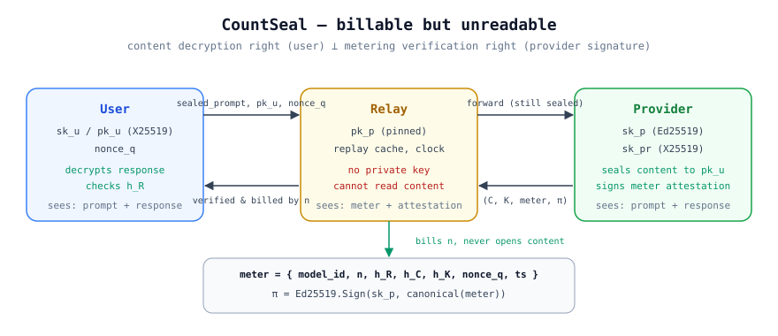

# CountSeal

**Verifiable metering + end-to-end encryption for LLM API relays.**
计费可验证的端到端加密 · billable but unreadable

[中文说明](README.zh-CN.md) · [Protocol spec](SPEC.md) · [Reference demo](demo/demo.py)

## The problem

LLM API relays (API gateways, resellers, shared-account proxies) must inspect HTTP traffic to bill by token count — which means they see **all your prompts and completions in plaintext**. Encrypting responses naively breaks billing: the relay can't verify the token count, so either side can cheat.

## The idea

Split the two rights apart:

| Right | Who holds it | Mechanism |
|-------|--------------|-----------|
| Content decryption | **User only** | X25519 sealed boxes → `sk_u` |
| Metering verification | **Provider signs, relay verifies** | Ed25519 attestation over `{n, h_R, h_C, h_K, nonce_q, ts}` |

The relay verifies a provider-signed **meter attestation** and bills by `n`, but holds no private key and never sees plaintext. The user decrypts locally and checks `h_R` (content hash) to confirm integrity. `nonce_q` + timestamp window stop replay; hashes bind the count to the actual bytes transmitted.

```
User                       Relay                        Provider
 ── sealed_prompt, pk_u, nonce_q ──▶── forward (sealed) ──▶
 ◀── (C, K, meter, π) ── verify π, bill n ── (C, K, meter, π) ──
 ── unseal k, decrypt, check h_R ──
```



## What each party sees

| | prompt | response | token count |
|---|---|---|---|
| Relay | ciphertext | ciphertext | verified ✓ |
| User | plaintext | plaintext | verifiable ✓ |
| Provider | plaintext | plaintext | attested ✓ |

## Quickstart

```bash
cd demo
pip install -r requirements.txt
python3 demo.py
```

The demo runs all three parties in one process: seals a mock prompt, generates a response with a meter attestation, has the relay verify & bill it (without decrypting), unseals on the user side, then tampers with one byte to show rejection.

## Spec

See [SPEC.md](SPEC.md) for message formats (KEM/DEM sealed boxes, meter attestation canonicalization), verification rules, and optional extensions (ZK range proofs over `n`, multi-relay audit chains, dispute settlement).

Algorithms: Ed25519 · X25519 + HKDF-SHA256 · AES-256-GCM · SHA-256.

## Status

Experimental. Published **2026-10** as an open protocol / defensive publication — implement, break, and improve it. Non-goals for v0.1: hiding usage volume, traffic-analysis resistance, protecting against a compromised provider.

## License

Apache-2.0 (includes a royalty-free patent grant).
